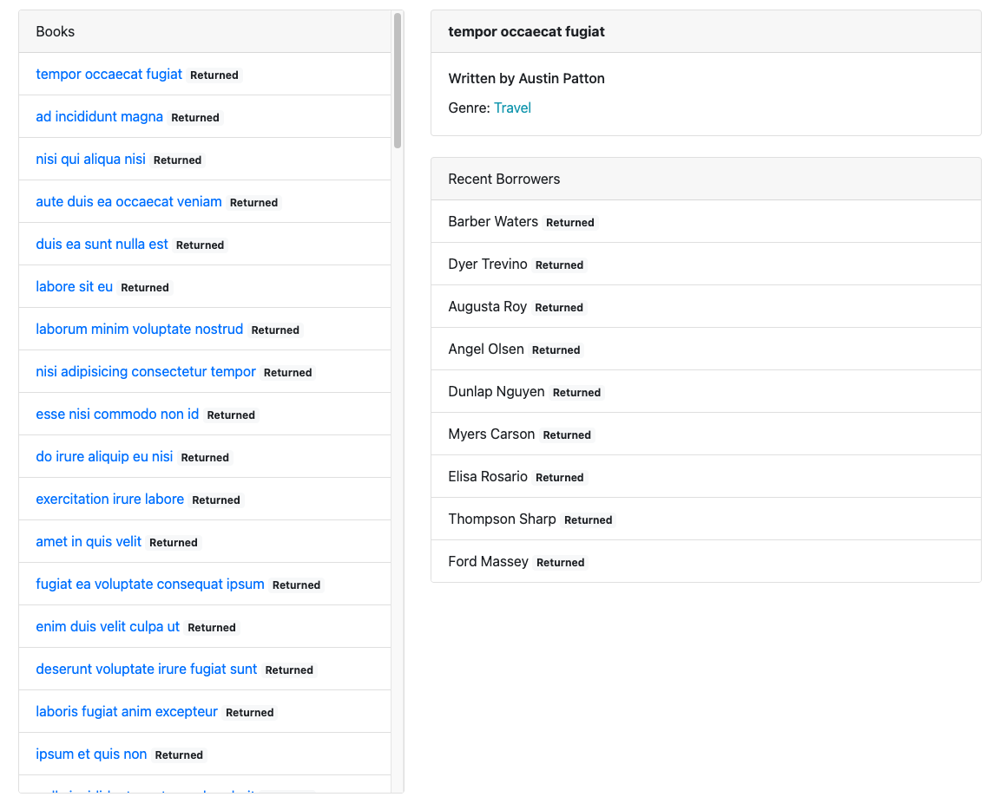
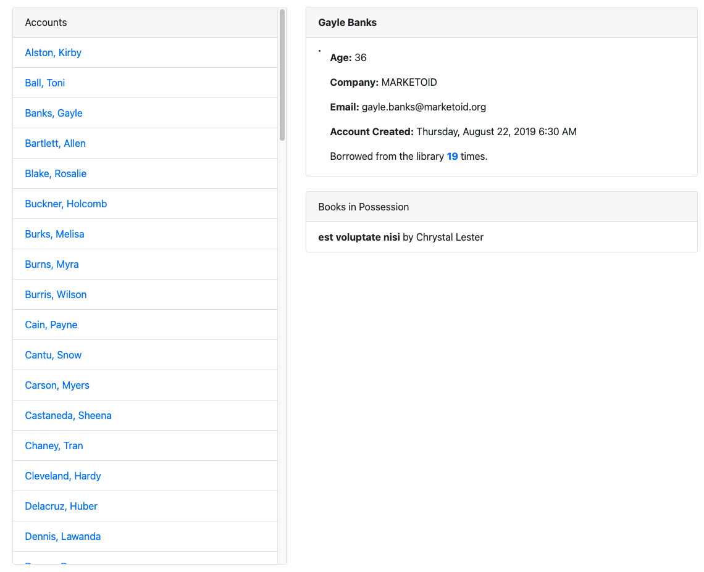

# Local Library

Your neighborhood has decided to put together a local library where people can lend and borrow books. One of the most important features to organize this is a dashboard that will show which books are available, which are currently out, and other general statistics about the program.

## Home Page

This project is designed for large datasets and build algorithms based on those datasets.

### Datasets Used

There are three datasets that are apart of this project: `accounts`, `authors`, and `books`.

## Stats by Book

- Each book represents a physical book but also contains additional information.
- represents someone who wrote one or more books in the library.

## Stats by Account

- An account represents a person who is registered with the library. Accounts can take out and return books.

## Technology

#### Built With:

- Javascript ES6, Bootstrap, HTML5, Mocha, Chai.

### Interface:

- Built to store files that are meant for your app's use only.
